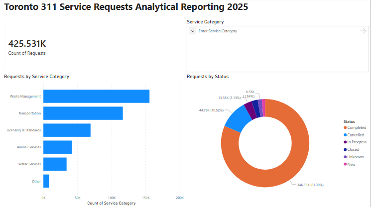
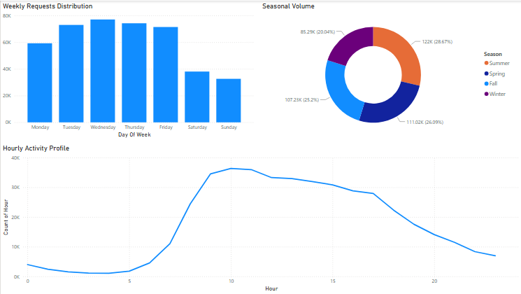
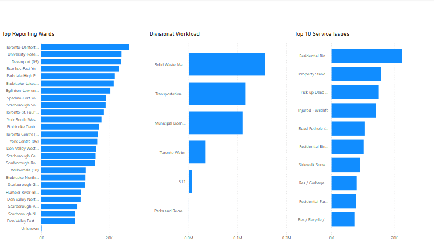

# Toronto 311 Service Analytics

Exploratory analysis of Toronto's 311 Service Request data, examining request volume, timing patterns, and category/ward-level trends — with an interactive Power BI dashboard built on top of the cleaned data.

## Dashboard



*Total requests, breakdown by service category, and status distribution.*



*Request volume by day of week, season, and hour of day showing a clear peak in mid-morning to early afternoon on weekdays.*



*Top reporting wards, division workload, and the 10 most common service issues.*

The full `.pbix` file is available in [`powerbi/`](powerbi/)  open it in Power BI Desktop to explore the data interactively (filter by category, ward, or status using the slicer).

## Data Source
Toronto 311 Service Requests dataset (`sr2025.csv`) City of Toronto Open Data.

## Scripts
1. `scripts/01_load_inspect.py` — loads the raw CSV, parses creation dates, and inspects data quality.
2. `scripts/02_clean_standardize.py` — removes duplicates and sparse columns, groups service divisions into categories, and saves a cleaned CSV.
3. `scripts/03_Insights.py` — analyzes the cleaned data for top categories, peak hours/days, seasonality, top wards, division workload, and status breakdown.

## Key Insights
- **Waste Management** and **Transportation** are the two largest service categories, together accounting for the majority of all requests.
- About **81% of requests are marked Completed**, with Cancelled requests making up roughly 10%.
- Request volume peaks on **weekday mornings**, climbing sharply after 6 AM and staying elevated from roughly 9 AM to 5 PM before tapering off overnight.
- **Summer and Fall** see the highest request volumes, with Winter the lowest — consistent with more outdoor/property related issues being reported in warmer months.
- A small number of wards account for a disproportionate share of requests, suggesting geographic hotspots worth further investigation.

## Requirements
- Python 3.x
- pandas
- Power BI Desktop (to open the `.pbix` dashboard)

## How to Run
```
cd scripts
python 01_load_inspect.py
python 02_clean_standardize.py
python 03_Insights.py
```

## Project Structure
```
toronto-311-service-analytics/
├── data/
│   ├── raw/
│   │   └── sr2025.csv
│   └── processed/
│       └── sr2025_cleaned.csv
├── scripts/
│   ├── 01_load_inspect.py
│   ├── 02_clean_standardize.py
│   └── 03_Insights.py
├── powerbi/
│   └── toronto_311_dashboard.pbix
├── images/
│   ├── overview.png
│   ├── timing.png
│   └── geography.png
└── README.md
```
